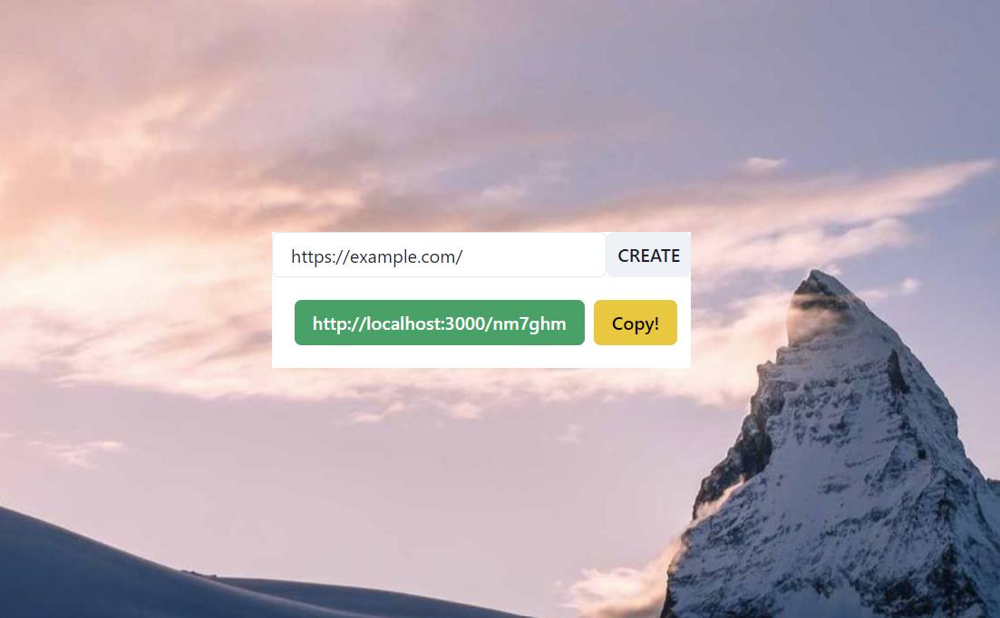

# Fullstack URL Shortener


> A Fullstack URL Shortener application ✨

## Technologies Used
- [Discord API](https://discord.com/developers)
- [MongoDB](https://www.mongodb.com/)
- [ExpressJs](https://expressjs.com/)
- [React](https://reactjs.org/)
- [NodeJs](https://nodejs.org/en/)
- [Yarn](https://yarnpkg.com/)
- [TypeScript](https://www.typescriptlang.org/)
- [Chakra UI](https://chakra-ui.com/)
- [Docker](https://www.docker.com/)

## Features
- Shortens a URL
- Redirects to the short URL
- Connects to a MongoDB Server
- Demonstrates Backend and Frontend Integration in One Repo

## Screenshots




## Setup

To run this project, here are the requirements:

- Yarn (1.22.19)
- MongoDB Server Setup (I'm using the MongoDB Atlas Cloud)
- Docker (20.10.11)

To look around with the code you can `git clone` this repository, or see it in GitHub Dev Mode (Click `"."`in your browser, or change `github.com` to `github.dev`).

## Usage

### Backend

1. Go to the [`server`](./server) directory.
2. Create `.env` file with the following content:
```
PORT=4000
DB_URI=<YOUR_MONGODB_URI>
```
3. Install all the packages with `npm install`.
4. Run it with `yarn dev`.
5. An alternative way to run this would be using Docker, use `docker-compose up -d` to run the application.

### Frontend

1. Go to the [`ui`](./ui) directory.
2. Create `.env` file with the following content:
```
REACT_APP_SERVER_ENDPOINT=http://localhost:4000
```
3. Install all the packages with `npm install`.
4. Run it with `yarn start`.

## Room for Improvement

Room for improvement:
- Deployment
- Add more functionality in Backend
- Make the Frontend more beautiful

## Acknowledgements

- [TomDoesTech](https://github.com/TomDoesTech) tutorial on URL Shortener 👏
- StackOverFlow
- Google
- All other resources in the internet that have been used


## Contact

Developed by [mhasan01](https://mhasan01.com/) - feel free to contact me!
